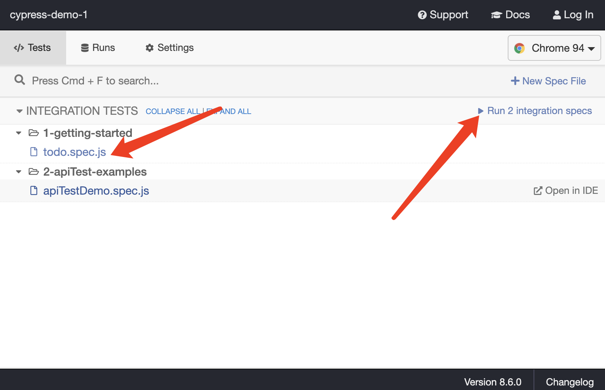
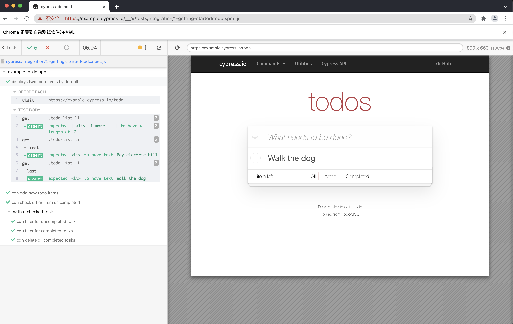
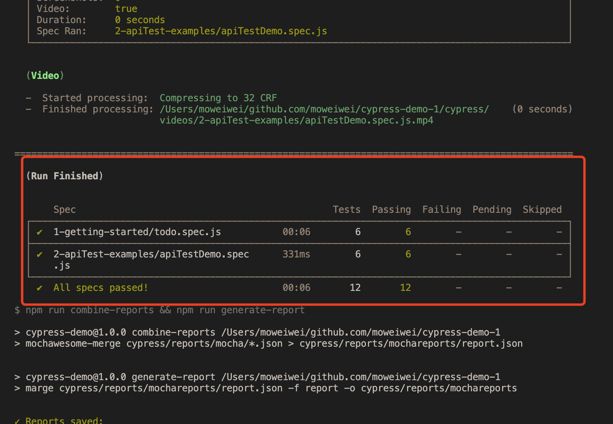
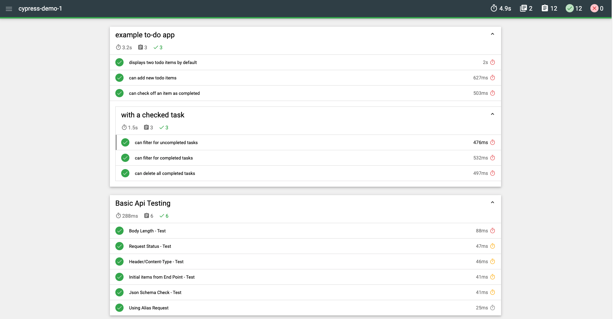

# Cypress Demo

[Demo Todos](https://example.cypress.io/todo)

## Quick Overview

Install Dependency

```sh
yarn install
```

Opening Cypress and run json-server By Using:

```sh
yarn start
```

After a moment, the Cypress Test Runner will launch. then, run all integration tests or click some spec to run.

.

Click a spec, it will open a browser to run the spec.



Run all tests and Generate report by the command:

```sh
yarn test
```



After all the tests run finished, Open `reports/mochareports/report.html` with a browser to view the generated test report.



## Demo Specs Case(cypress/integration)

TODOS Cases

```js
it("displays two todo items by default", () => {
  cy.get(".todo-list li").should("have.length", 2);

  cy.get(".todo-list li").first().should("have.text", "Pay electric bill");
  cy.get(".todo-list li").last().should("have.text", "Walk the dog");
});
```

```js
it("can add new todo items", () => {
  const newItem = "Feed the cat";

  cy.get("[data-test=new-todo]").type(`${newItem}{enter}`);

  cy.get(".todo-list li")
    .should("have.length", 3)
    .last()
    .should("have.text", newItem);
});
```

```js
it("can check off an item as completed", () => {
  cy.contains("Pay electric bill")
    .parent()
    .find("input[type=checkbox]")
    .check();

  cy.contains("Pay electric bill")
    .parents("li")
    .should("have.class", "completed");
});
```

```js
it("can filter for uncompleted tasks", () => {
  cy.contains("Active").click();

  cy.get(".todo-list li")
    .should("have.length", 1)
    .first()
    .should("have.text", "Walk the dog");

  cy.contains("Pay electric bill").should("not.exist");
});
```

```js
it("can filter for completed tasks", () => {
  cy.contains("Completed").click();

  cy.get(".todo-list li")
    .should("have.length", 1)
    .first()
    .should("have.text", "Pay electric bill");

  cy.contains("Walk the dog").should("not.exist");
});
```

```js
it("can delete all completed tasks", () => {
  cy.contains("Clear completed").click();

  cy.get(".todo-list li")
    .should("have.length", 1)
    .should("not.have.text", "Pay electric bill");

  cy.contains("Clear completed").should("not.exist");
});
```

Api Test Cases

```js
it("Body Length - Test", () => {
  cy.request("http://localhost:3000/todos")
    .its("body")
    .should("have.length", 2);
});
```

```js
it("Request Status - Test", () => {
  cy.request("http://localhost:3000/todos").its("status").should("eq", 200);
});
```

```js
it("Header/Content-Type - Test", () => {
  cy.request("http://localhost:3000/todos")
    .its("headers")
    .its("content-type")
    .should("include", "application/json")
    .and("include", "charset=utf-8");
});
```

```js
it("Initial items from End Point - Test", () => {
  cy.request("http://localhost:3000/todos")
    .its("body")
    .should("deep.eq", ApiItems);
});
```

```js
it("Json Schema Check - Test", () => {
  cy.request("http://localhost:3000/todos")
    .its("body")
    .each((value) => {
      expect(value).to.have.all.keys("id", "title", "completed");
    });
});
```

```js
it("Using Alias Request", function () {
  cy.get("@todos").should((response) => {
    expect(response.body).to.have.length(2);
    expect(response).to.have.property("headers");
    expect(response).to.have.property("duration");
  });
});
```
